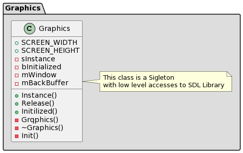
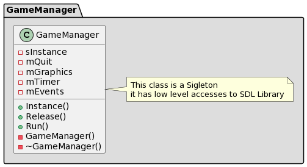
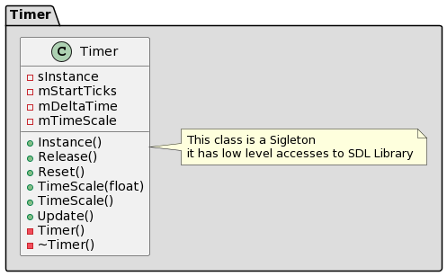
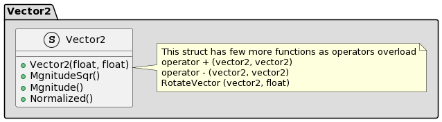
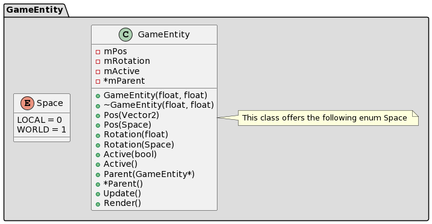
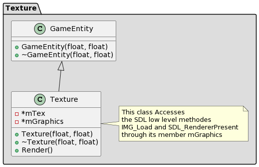

# GalagaSDL2 Architecture overview

This document lists all the classes of the application and gives a small description of their role in the structure of the application. For more detailed information about each class please refer to the doxygen documentation on each header file.

## Table of content 

  - [Graphics class ](#graphics-class)
  - [GameManager class ](#gamemanager-class)
  - [Timer class ](#timer-class)
  - [Vector2 class ](#vector2-class)
  - [GameEntity class ](#gameentity-class)
  - [Texture class ](#texture-class)

## Graphics class <a name="graphics-class"></a>

This class uses the singleton design pattern (no constructor, unique instance, static methods to access members), it has the responsability of defining the Graphics properties of the application such as screen width and hieght, the SDL_Window and SDL_Surface. It is this class' responsability to initialize the SDL Library as well as to call SDL_Quit() at the end when the class destructor is called.

- Here is a UML view of of the class: 

<p align="center">
  
</p>

- Here is the equivalent UML code :

```
@startuml
package "Graphics" #DDDDDD {
    class Graphics {
        + SCREEN_WIDTH
        + SCREEN_HEIGHT
        - sInstance
        - bInitialized
        - mWindow
        - mBackBuffer
        - mRenderer
        + Instance()
        + Release()
        + Initilized()
        + LoadTexture()
        + ClearBackBuffer()
        + DrawTexture()
        + Render()
        - Graphics()
        - ~Graphics()
        - Init()
    }

    note right of Graphics 
        This class is a Sigleton
        with low level accesses to SDL Library
    end note
}
@enduml
```
## GameManager class <a name="gamemanager-class"></a>

This class uses the singleton design pattern, this class will create in its constructor an instance of the object Graphics. It is this class responsibility to insure that the Graphics are initialized and to run the renderring. This class will also call the SDL_PollEvent() in a loop in order to monitor the events (user inputs, ...).

It uses Graphics and Timer classes to create members instances and handles their release too.

- Here is a UML view of of the class: 

<p align="center">
  
</p>

- Here is the equivalent UML code :

```
@startuml
package "GameManager" #DDDDDD {
    class GameManager {
        - sInstance
        - FRAME_RATE
        - mQuit
        - mGraphics
        - mTimer
        - mEvents
        - mTex
        + Instance()
        + Release()
        + Run()
        - GameManager()
        - ~GameManager()
    }

    note right of GameManager 
        This class is a Sigleton
        it has low level accesses to SDL Library
    end note
}
@enduml
```

## Timer class <a name="timer-class"></a>

This class uses the singleton design pattern, it uses SDL_GetTicks() to get an integer number that represents the milliseconds since SDL_Init(). This class gives access to a member DeltaTime() that tracks the milliseconds count since last time we've updated the timer.

- Here is a UML view of of the class: 

<p align="center">
  
</p>

- Here is the equivalent UML code :

```
@startuml
package "Timer" #DDDDDD {
    class Timer {
        - sInstance
        - mStartTicks
        - mDeltaTime
        - mTimeScale
        + Instance()
        + Release()
        + Reset()
        + TimeScale(float)
        + TimeScale()
        + Update()
        - Timer()
        - ~Timer()
    }

    note right of Timer 
        This class is a Sigleton
        it has low level accesses to SDL Library
    end note
}
@enduml
```

## Vector2 class <a name="Vector2-class"></a>

This class is public, it provides basic geometrical operations for vectors. The vector concept here is pretty basic : one point is identified by its x and y coordinates and the second point is always the origin on the imaginary cartesian coordinate system.

This class is public, hence using struct to describe it, it also offers overloads of operator + operator - and operator *. This class is inlined meaning there is no cpp file for it.

- Here is a UML view of of the class: 

<p align="center">
  
</p>

- Here is the equivalent UML code :

```
@startuml
package "Vector2" #DDDDDD {
    struct Vector2 {
        + Vector2(float, float)
        + MgnitudeSqr()
        + Mgnitude()
        + Normalized()
    }

    note right of Vector2 
        This struct has few more functions as operators overload
        operator + (vector2, vector2)
        operator - (vector2, vector2)
        RotateVector (vector2, float)
    end note
}
@endumll
```

> click [this link](vector2-operations.md) to see the explanation of Vector2 vector rotation operation.


## GameEntity class <a name="gameentity-class"></a>

This Class Defines basic operations for defining and manipulating an entity in the application, it uses the class Vector2 to do some basic vector operations (rotation, addition) and allows to define it self as a member in order to link GameEntity objects together for more complexe operations.

- Here is a UML view of of the class: 

<p align="center">
  
</p>

- Here is the equivalent UML code :

```
@startuml
package "GameEntity" #DDDDDD {
    class GameEntity {
        - mPos
        - mRotation
        - mActive
        - *mParent
        + GameEntity(float, float)
        + ~GameEntity(float, float)
        + Pos(Vector2)
        + Pos(Space)
        + Rotation(float)
        + Rotation(Space)
        + Active(bool)
        + Active()
        + Parent(GameEntity*)
        + *Parent()
        + Update()
        + Render()
    }

    enum Space {
        LOCAL = 0
        WORLD = 1
    }

    note right of GameEntity 
        This class offers the following enum Space 
    end note
}
@enduml
```

## Texture class <a name="texture-class"></a>

This class is derived fron GameEntity class, its constructor takes a string path to an image of type png, jpeg or gif. It instantiates a member of type Graphics that gives it access to the low level SDL method IMG_Load and SDL_RenderPresent.

- Here is a UML view of of the class:

<p align="center">
  
</p>

- Here is the equivalent UML code :

```
@startuml
package "Texture" #DDDDDD {
    class GameEntity {
        + GameEntity(float, float)
        + ~GameEntity(float, float)
    }
    class Texture {
        - *mTex
        - *mGraphics
        + Texture(float, float)
        + ~Texture(float, float)
        + Render()
    }
    GameEntity <|-- Texture

    note right of Texture
        This class Accesses
        the SDL low level methodes
        IMG_Load and SDL_RenderPresent
        through its member mGraphics
    end note
}
@enduml
```
