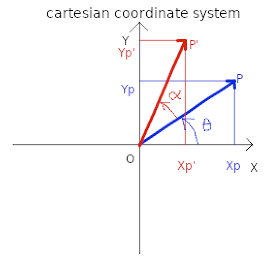

## Go further in explaining Vector2 class

Here is a collection of the math behind Vector2 class, the bellow figure shows a cartesian coordinate system with O as origin point (0, 0) and two points P and P'. The vector $\overrightarrow{OP}$ has an angle of value $\theta$ to the X axes, he vector $\overrightarrow{OP'}$ has an angle of value $\alpha$ to relatively to $\overrightarrow{OP}$.

  

Here is the vectors values :

$$
\overrightarrow{OP} \binom{X_p-0}{Y_p-0}=\binom{X_p}{Y_p}
$$
$$
\overrightarrow{OP^{\prime}} \binom{X_p^{\prime}-0}{Y_p^{\prime}-0}=\binom{X_p^{\prime}}{Y_p^{\prime}}
$$

Based on the above coordinates, we can determin the magnitude of $\overrightarrow{OP}$ :

$$
\cos(\theta) = \frac{X_p}{\|\overrightarrow{OP}\|}
$$

$$
\sin(\theta) = \frac{Y_p}{\|\overrightarrow{OP}\|}
$$

$$
\sin^2(\theta) + \cos^2(\theta) =  \frac{Y^2_p + X^2_p}{\|\overrightarrow{OP}\|}=1
$$

Magnitude is :

$$
Magnitude(\overrightarrow{OP}) =  \|\overrightarrow{OP}\| = \sqrt[2]{X_p² + Y_p²}
$$

knowing that $\overrightarrow{OP'}$ has an angle $\alpha$ relatively to $\overrightarrow{OP}$, we can determin its value with the following expression:

based on the coordinates : 
$$
\|\overrightarrow{OP'}\| \times \cos(\theta + \alpha) = X_p'
$$

$$
\|\overrightarrow{OP'}\| \times \sin(\theta + \alpha) = Y_p'
$$

and knowing that:
$$
\cos(\theta + \alpha) = \cos(\theta) \times \cos(\alpha) - \sin(\theta) \times \sin(\alpha)
$$

and:

$$
\sin(\theta + \alpha) = \sin(\theta) \times \cos(\alpha) + \cos(\theta) \times \sin(\alpha)
$$

we can write this expression if we rotate $\overrightarrow{OP}$ by an angle $\alpha$:
$$
\overrightarrow{OP'} =\binom{X_p'}{Y_p'}=\binom{X_p \times \cos(\alpha) - Y_p \times \sin(\alpha)}{X_p \times \sin(\alpha) + Y_p \times \cos(\alpha)}
$$